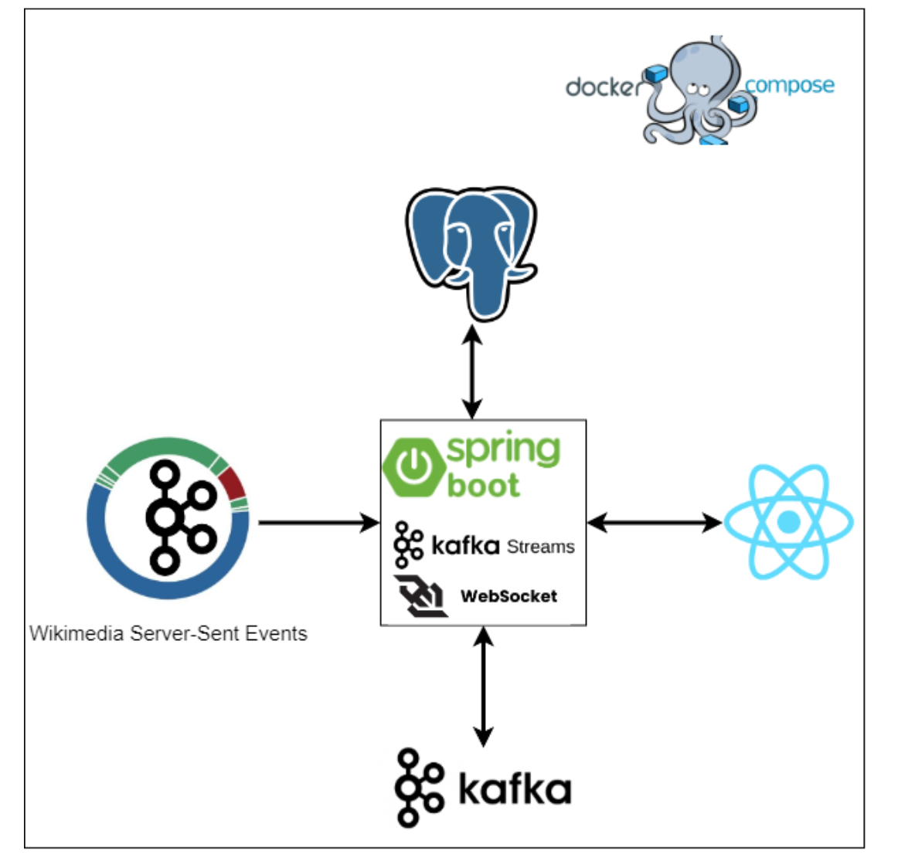
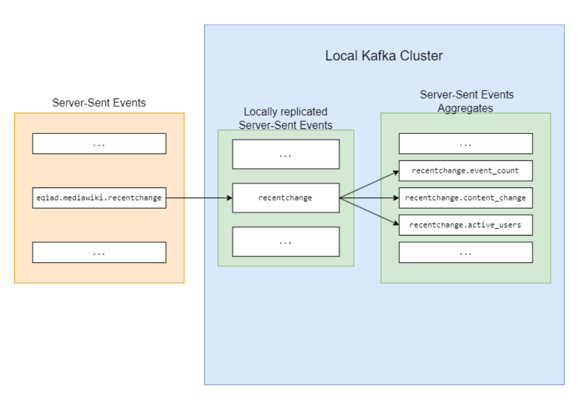
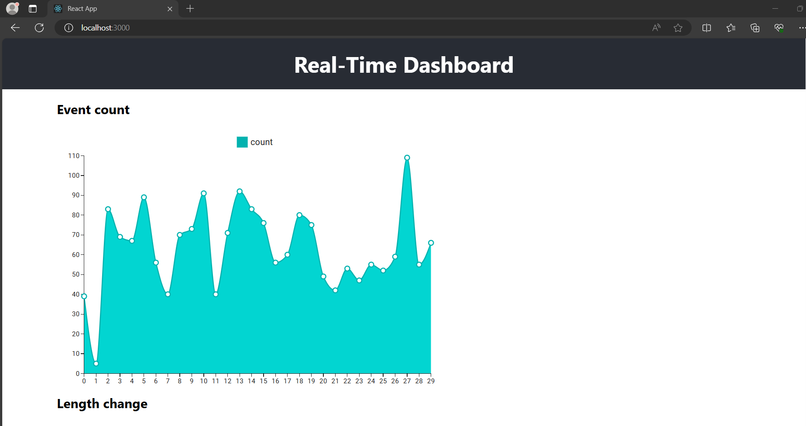
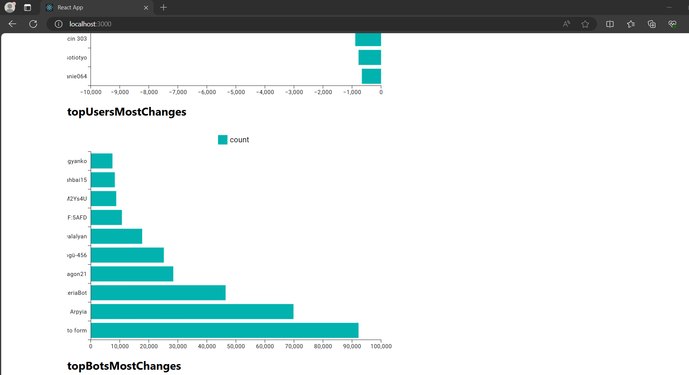
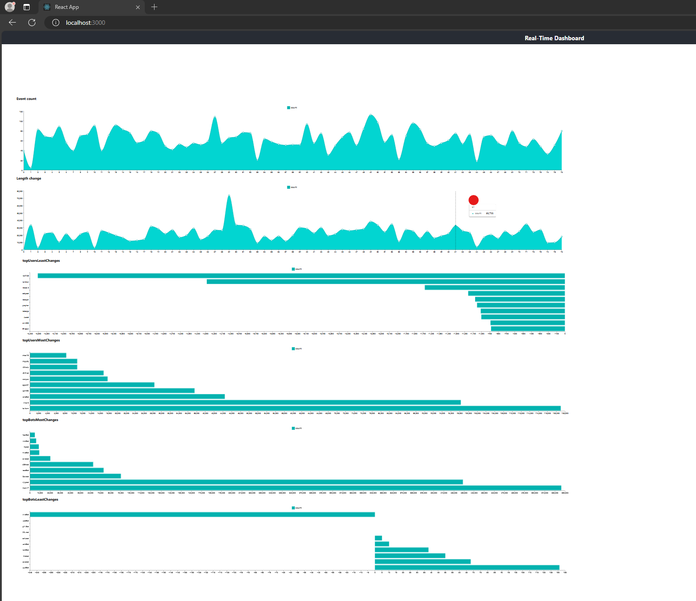

# Real-Time Dashboard


## Functionality
The Real-Time Dashboard is an application designed to process events sourced from Wikimedia Server Sent Events 
streams. These streams capture all changes made on Wikipedia pages, whether it's the creation of a new page, 
deletion of an existing one, or edits made by users and bots.

Currently, the app focuses on monitoring the [recentchange](https://stream.wikimedia.org/v2/stream/recentchange) 
topic, which consists of events representing changes made to pages by users and bots.

The main functionalities of the dashboard include:

1. **Graph of New Events**: Visual representation of the number of new events that appear during specific time windows, such as every 3 seconds.

2. **Graph of Changes in Content Length**: Visual representation of changes in the overall length of content during specific time window, for example, every 3 seconds.

3. **Ranking of Least Changes Added**: Displays a ranking of the users or bots who made the least changes, measured in character count. This count may be negative if content was deleted.

4. **Ranking of Most Changes Added**: Displays a ranking of the users or bots who made the most changes, measured in character count.

5. **Saving Timeseries Data**: The application saves timeseries data in a database for further analysis and reference.

By providing these functionalities, the Real-Time Dashboard offers insights into the dynamic nature of Wikipedia pages and allows users to track changes in real-time, analyze user behavior, and monitor the evolution of content over time.

## Backend Implementation 

The functionality on the backend side is implemented in the following steps:

1. **EventStreamConsumer**: This class implements the `ApplicationRunner` interface and starts after the application context is loaded. It begins copying the `recentchange` topic to the local Kafka cluster for further processing.

2. **Event Processing**: Once events are written to the local Kafka cluster, processors that extend the `BaseEventProcessor` class start processing the events. They utilize the aggregating capabilities of the Kafka Streams library. After processing, the aggregates are written to the appropriate Kafka topics and database.

3. **KafkaAggreatesPublisherService**: This class listens to all topics to which aggregates are published. After the aggregates are written to the Kafka topic, they are sent to the client via this service.

4. **Data Analysis**: Aggregates written to the database can be further used for data analysis in wider time windows, although this functionality is not implemented.

By following this process, the backend efficiently processes events from the Wikimedia Server Sent Events streams, aggregates them, and provides them to the client for real-time monitoring.



## Frontend Implementation

The frontend utilizes the SockJS library for reading topics published through WebSocket. The `WebSocketComponent` was implemented to read messages from a specified topic.

A message processor can be passed to `WebSocketComponent` to process and visualize collected messages. Two message processors have been implemented:

1. **Graph Component**: This component visualizes messages in the form of time series data, for example: `[1, 123, -54.5, 1111]`.

2. **RankingCharts Component**: This component visualizes top lists of users ordered by a provided value. For instance:

```json
{
    "topBotsMostChanges": [
        {"username": "Wicci'o'Bot", "changesLength": 167822, "bot": true},
        {"username": "FlickreviewR 2", "changesLength": 170025, "bot": true},
        {"username": "Dcirovicbot", "changesLength": 184638, "bot": true},
        {"username": "BgeeDB-bot", "changesLength": 280222, "bot": true}
    ]
}
```

## Used Technologies

* Typescript
* React
* SockJS and STOMP
* mui/x-charts
* Docker and Docker Compose
* Spring Boot
* Kafka
* Kafka Streams
* JPA and Hibernate
* PostgreSQL
* Testcontainers
* Junit
* WebFlux
* WebSocket
* Lombok

## Usage

The app is designed to run in a local environment due to its high complexity and resource-intensive nature, which can produce multiple gigabytes of data.

### Requirements

Ensure the following software is installed before using the app:

- JDK 21
- Docker and Docker Compose
- NPM

### Starting the Backend Instance

To start the backend instance, execute the following command in your terminal:

```bash
./gradlew clean assemble; docker compose up --build
```

### Starting the Frontend Instance

Navigate to the dashboard-client directory and start the frontend using the following commands:

```bash
cd dashboard-client
npm start
```

## Tests

Integration tests on the backend side were implemented using the Testcontainers library. This library enables seamless creation of a PostgreSQL instance and Kafka cluster for testing purposes.

To facilitate the writing of integration tests, a custom annotation `@EnableTestContainers` and a base class `AbstractIntegrationTest` were created. These utilities simplify the setup and teardown of test environments, allowing developers to focus on writing effective test cases without the burden of managing infrastructure.

To run all tests in backend run command: `./gradlew clean build`;

## App Screenshots 




